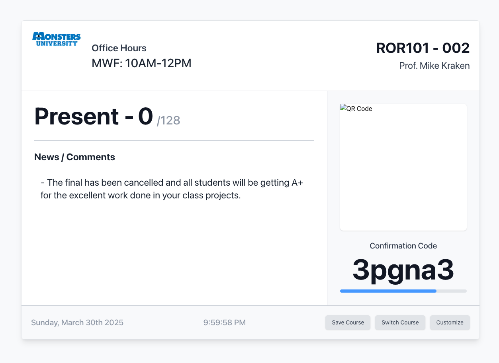
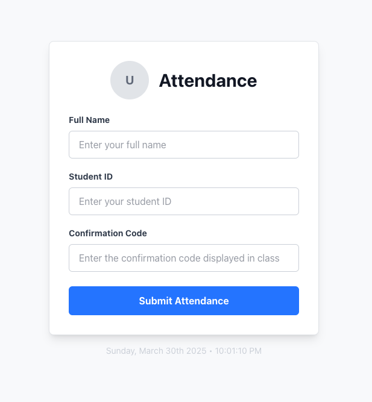

# Attendance Tracker

A comprehensive attendance tracking system designed for professors and educators to simplify classroom attendance management. This application provides a modern, efficient way to record student attendance through locally hosted web services.

## Overview

Attendance Tracker creates a locally accessible web server that students can connect to when physically present in the classroom. The system offers:

- **Customizable Interface**: Manage multiple courses, sections, and preferences
- **QR Code Generation**: Students can scan to access the attendance form
- **Real-time Updates**: See who's present as students mark attendance
- **Data Export**: Export attendance records to CSV files for integration with other systems
- **Local-network Only**: Ensures students must be physically present to mark attendance

## Key Features

- **Course Management**: Create and switch between multiple courses
- **Section Support**: Handle multiple sections per course
- **Customization**: Change details like professor name, office hours, etc.
- **Confirmation Codes**: Time-limited codes ensure attendance is taken only during class
- **QR Code Access**: Easily accessible attendance form via QR code
- **Local Network Restriction**: Prevents remote attendance marking
- **CSV Export**: Export attendance data for gradebooks and LMS integration

## Tech Stack

### Frontend

- **Next.js 15**: React-based framework for the user interface
- **TailwindCSS**: Utility-first CSS framework for styling
- **React 19**: UI component library

### Backend

- **Rust**: High-performance language for the core application
- **Actix-web**: Web server framework
- **SQLite**: Local database for storing attendance records
- **WebSockets**: For real-time attendance updates

## Screenshots



- Dashboard with real-time student count
- QR code and confirmation code display
- Course customization interface

---



- Student attendance submission form

## Getting Started - Development

### Prerequisites

- [Rust](https://www.rust-lang.org/tools/install) (1.75 or newer)
- [Node.js](https://nodejs.org/) (18 or newer)
- [npm](https://www.npmjs.com/) (9 or newer)

### Backend Setup

```bash
# Navigate to backend directory
cd back-end

# Build and run the server
cargo run --release
```

### Frontend Setup

```bash
# Navigate to frontend directory
cd web-ui

# Install dependencies
npm install

# Build the frontend
npm run build

# For development with hot reload
npm run dev
```

### All-in-one Setup

When running the backend with `cargo run --release`, it will:

1. Start the database
2. Initialize the web server
3. Serve the built frontend files
4. Automatically open a browser to the application

## Project Structure

```
attendance-tracker/
├── back-end/              # Rust backend server
│   ├── src/               # Source code
│   │   ├── api/           # API endpoints
│   │   ├── db/            # Database operations
│   │   ├── models/        # Data models
│   │   ├── services/      # Business logic
│   │   └── utils/         # Utility functions
│   └── Cargo.toml         # Rust dependencies
├── web-ui/                # Next.js frontend
│   ├── app/               # Frontend application
│   │   ├── attendance/    # Attendance form
│   │   ├── components/    # Reusable components
│   │   └── services/      # Frontend services
│   ├── public/            # Static assets
│   └── package.json       # JavaScript dependencies
└── README.md              # Project documentation
```

## Development

For development, you can run both the frontend and backend separately:

```bash
# Terminal 1 - Run the backend
cd back-end
cargo run

# Terminal 2 - Run the frontend with hot reloading
cd web-ui
npm run dev
```

## Contributing

Contributions to the project are welcome! Please follow these steps:

1. Fork the repository
2. Create a feature branch: `git checkout -b <feature-name>`
3. Make your changes and commit them: `git commit -m 'Added <feature-name/description>'`
4. Push to your branch: `git push origin <feature-name>`
5. Submit a pull request

For major changes or features, please open an issue first to discuss what you would like to change.

## License

This project is licensed under the GPLv3 License - see the `LICENSE.md` file for details.

## Acknowledgments

- Special thanks to my Thermodynamics professor who inspired this project
- The Rust and Next.js communities for excellent documentation and tools
