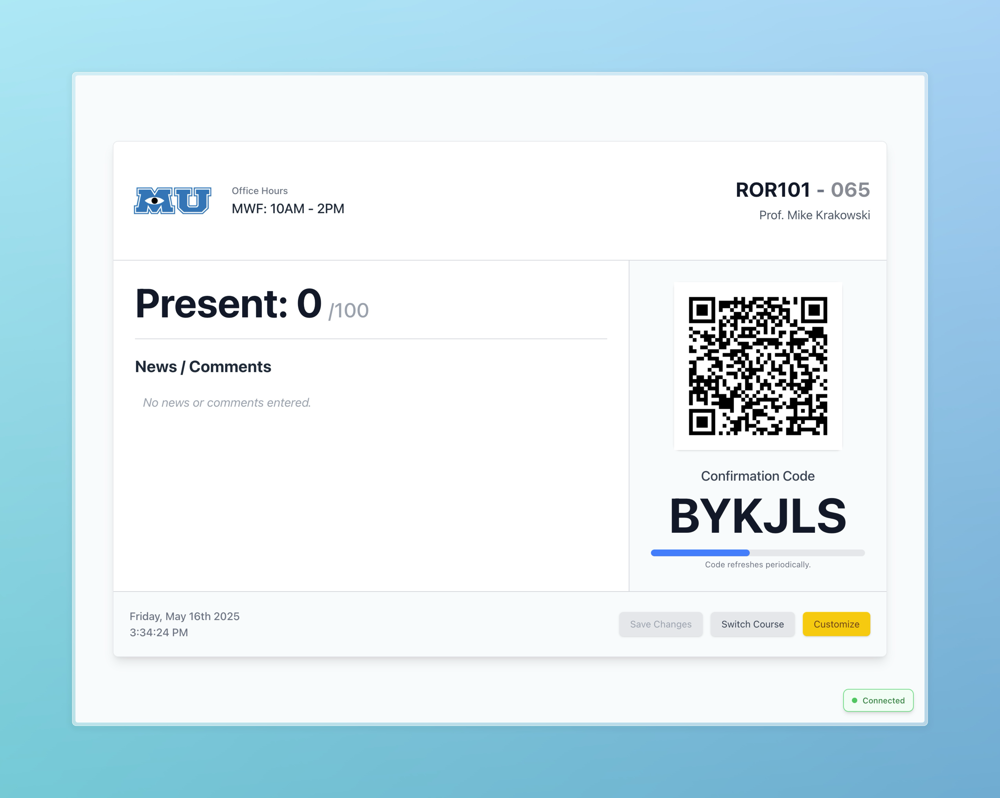

# Attendance Tracker

A comprehensive attendance tracking system designed for professors and educators to simplify classroom attendance management. This application provides a modern, efficient way to record student attendance through locally hosted web services.

## Overview

Attendance Tracker creates a locally accessible web server that students can connect to when physically present in the classroom. The system offers:

- **Customizable Interface**: Manage multiple courses, sections, and preferences
- **QR Code Generation**: Students can scan to access the attendance form
- **Real-time Updates**: See who's present as students mark attendance
- **Data Export**: Export attendance records to CSV files for integration with other systems
- **Local-network Only**: Ensures students must be physically present to mark attendance

## Key Features

- **Course Management**: Create and switch between multiple courses, including custom logo uploads.
- **Section Support**: Handle multiple sections per course.
- **Customization**: Change details like professor name, office hours, and course news.
- **Robust Confirmation Codes**: Time-limited codes ensure attendance is taken only during class for the _actively displayed course_.
- **QR Code Access**: Easily accessible attendance form via QR code for the active course.
- **Real-time Dashboard**: Live updates for student attendance count and connection status.
- **Local Network Restriction**: Prevents remote attendance marking (by default, configurable host binding).
- **CSV Export**: Export attendance data for gradebooks and LMS integration.
- **Streamlined Build Process**: Includes a script (`run_full_app.sh`) to automate the full build and run process.

## Tech Stack

### Frontend

- **Next.js 15**: React-based framework for the user interface
- **TailwindCSS**: Utility-first CSS framework for styling
- **React 19**: UI component library
- **Bun**: Fast JavaScript all-in-one toolkit (runtime, bundler, package manager)

### Backend

- **Rust**: High-performance language for the core application
- **Actix-web**: Web server framework
- **SQLite**: Local database for storing attendance records
- **WebSockets**: For real-time attendance updates

## Screenshots



- Dashboard with real-time student count
- QR code and confirmation code display
- Course customization interface

---


- Student attendance submission form

## Getting Started - Development

### Prerequisites

- [Rust](https://www.rust-lang.org/tools/install) (1.75 or newer)
- [Node.js](https://nodejs.org/) (18 or newer) - Primarily for `npx` if not using Bun for everything, or if specific global Node tools are needed.
- [Bun](https://bun.sh/) (1.0 or newer) - Recommended for frontend development and running scripts.
- [npm](https://www.npmjs.com/) (9 or newer) - Can be used if Bun is not available, though scripts are geared towards Bun.

### Backend Setup

```bash
# Navigate to backend directory
cd back-end

# Build and run the server for development
cargo run

# For a release build (used by the full app script)
# cargo build --release
```

### Frontend Setup

```bash
# Navigate to frontend directory
cd web-ui

# Install dependencies (using Bun is recommended)
bun install

# Build the frontend (using Bun)
bun run build

# For development with hot reload (using Bun)
bun run dev
```

### All-in-one Setup (Recommended)

The easiest way to build and run the entire application (frontend and backend bundled) is to use the provided script from the **root directory** of the project:

```bash
# Ensure the script is executable
chmod +x ./run_full_app.sh

# Run the script
./run_full_app.sh
```

This script will:

1. Build the Next.js frontend for static export.
2. Copy the built frontend assets to the location expected by the backend.
3. Build the Rust backend in release mode.
4. Launch the backend server, which will serve the frontend.
5. Automatically attempt to open a browser to the application.

Make sure you have an `.env` file configured at the root (you can copy `.env.example`).

## Project Structure

```
attendance-tracker/
├── .env.example           # Example environment variables
├── .gitignore
├── LICENSE.md
├── README.md
├── run_full_app.sh        # Script to build and run the entire application
├── back-end/              # Rust backend server
│   ├── migrations/        # Database schema migrations
│   ├── src/               # Source code
│   │   ├── api/           # API endpoints
│   │   ├── db/            # Database operations
│   │   ├── errors/        # Error handling
│   │   ├── middleware/    # Actix middleware
│   │   ├── models/        # Data models
│   │   ├── services/      # Business logic
│   │   └── utils/         # Utility functions
│   ├── static_frontend/   # Copied built frontend (generated, gitignored)
│   └── Cargo.toml         # Rust dependencies
├── web-ui/                # Next.js frontend
│   ├── app/               # Frontend application
│   │   ├── attendance/    # Attendance form page
│   │   ├── components/    # Reusable UI components (dashboard, ui, icons)
│   │   ├── context/       # React context providers
│   │   ├── hooks/         # Custom React hooks
│   │   └── services/      # Frontend API services
│   ├── public/            # Static assets (e.g., default images)
│   ├── next.config.mjs    # Next.js configuration (ensure output: 'export')
│   └── package.json       # JavaScript dependencies (managed with Bun)
└── readme-assets/         # Images for README
```

## Development (Separate Terminals for Hot Reloading)

For a more iterative development experience with frontend hot-reloading:

```bash
# Terminal 1 - Run the backend
cd back-end
cargo run
```

```bash
# Terminal 2 - Run the frontend with hot reloading
cd web-ui
bun run dev
```

This setup allows the Next.js development server to handle frontend changes instantly, while the Rust backend runs independently. Note that in this mode, the backend won't serve the frontend files directly from its build path; you'll access the Next.js dev server (usually `http://localhost:3000`). The backend API will still be available (e.g., `http://localhost:8080/api/...`).

## Contributing

Contributions to the project are welcome! Please follow these steps:

1. Fork the repository
2. Create a feature branch: `git checkout -b <feature-name>`
3. Make your changes and commit them: `git commit -m 'Added <feature-name/description>'`
4. Push to your branch: `git push origin <feature-name>`
5. Submit a pull request

For major changes or features, please open an issue first to discuss what you would like to change.

## License

This project is licensed under the GPLv3 License - see the `LICENSE.md` file for details.

## Acknowledgments

- Special thanks to my Thermodynamics professor who inspired this project
- The Rust and Next.js communities for excellent documentation and tools
