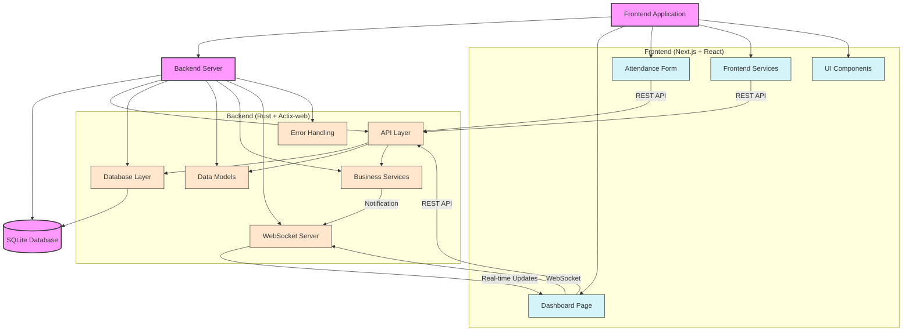

# Attendance Tracker Architecture

## System Overview

The Attendance Tracker is a client-server application designed to simplify classroom attendance tracking for professors. The system consists of:

- **Backend**: A Rust-based Actix-web server with SQLite database
- **Frontend**: A Next.js application with React and TailwindCSS
- **Communication Layer**: REST APIs and WebSockets for real-time updates

The application runs as a local service that provides a dashboard for professors and an attendance submission form for students.

## Core Components

### 1. Backend Server

The backend is built with Rust using the Actix-web framework and provides:

#### Key Components

1. **API Layer** (`back-end/src/api/`)

   - RESTful endpoints for course management, attendance submission, preferences, etc.
   - WebSocket endpoint for real-time attendance updates
   - Public and host-only endpoints with different access restrictions

2. **Database Layer** (`back-end/src/db/`)

   - SQLite database with tables for courses, attendance records, preferences, etc.
   - Query functions for CRUD operations on data models

3. **Models** (`back-end/src/models/`)

   - Data structures that represent the domain entities (courses, attendance, etc.)
   - Serialization/deserialization logic for API communication

4. **Services** (`back-end/src/services/`)

   - Business logic that operates across different components
   - Background services like confirmation code generation
   - WebSocket server implementation for real-time updates

5. **Error Handling** (`back-end/src/errors.rs`)

   - Centralized error handling and conversion to HTTP responses
   - Consistent error formatting for API consumers

6. **Configuration** (`back-end/src/config.rs`)
   - Application settings loaded from environment variables

### 2. Frontend Application

The frontend is built with Next.js 15 and React 19, using TailwindCSS for styling:

#### Key Components

1. **Dashboard Page** (`web-ui/app/page.tsx`)

   - Professor view for monitoring and managing attendance
   - Course management interface
   - Real-time attendance count display
   - QR code and confirmation code display

2. **Attendance Form** (`web-ui/app/attendance/page.tsx`)

   - Student-facing form for submitting attendance
   - Confirmation code validation
   - Success/error handling

3. **Services** (`web-ui/app/services/`)

   - `preferencesService.ts`: Course preferences management
   - `confirmationCodeService.ts`: Confirmation code handling

4. **Components** (`web-ui/app/components/`)
   - Reusable UI components like `LogoUploader`
   - Icon components

### 3. Communication Flow

1. **REST API**

   - Used for CRUD operations on courses, preferences, and attendance records
   - File uploads for logos
   - QR code generation

2. **WebSockets**

   - Real-time attendance count updates to the dashboard
   - Connection management with heartbeat mechanism

3. **Confirmation Codes**
   - Temporary codes generated by the backend
   - Used to verify attendance submissions are happening during class time
   - Refreshed periodically for security

## Key Technical Decisions

### 1. Rust Backend

- **Why**: Performance, safety, and low resource usage
- **Benefits**: Fast startup time, efficient handling of concurrent requests, strong type system to prevent bugs

### 2. SQLite Database

- **Why**: Simplicity, portability, no external dependencies
- **Benefits**: Self-contained database, easy to distribute, no separate database server needed

### 3. Actix-web Framework

- **Why**: High-performance async web framework for Rust
- **Benefits**: Excellent concurrency support, modular architecture, WebSocket support

### 4. Next.js Frontend

- **Why**: Modern React framework with built-in routing and SSR capabilities
- **Benefits**: Fast page loads, straightforward component architecture, great developer experience

### 5. WebSockets for Real-time Updates

- **Why**: Need for immediate attendance count updates
- **Benefits**: Efficient push-based updates without polling, reduced server load

### 6. Confirmation Codes

- **Why**: Ensure attendance is taken during class time only
- **Benefits**: Prevents students from marking attendance remotely or outside class hours

### 7. QR Codes

- **Why**: Easy access to the attendance form
- **Benefits**: Students don't need to manually enter URLs, reduces friction in attendance process

### 8. TailwindCSS

- **Why**: Utility-first CSS framework for rapid UI development
- **Benefits**: Consistent styling, responsive design, minimal CSS footprint

## Data Flow

1. **Professor Setup**:

   - Professor creates/selects a course and customizes settings
   - Backend stores course details in the database
   - QR code and confirmation code are generated

2. **Student Attendance**:

   - Student scans QR code to access attendance form
   - Student enters name, ID, and confirmation code
   - Backend validates submission and records attendance
   - WebSocket notification updates the dashboard in real-time

3. **Attendance Monitoring**:
   - Professor views real-time attendance count on dashboard
   - Can export attendance records to CSV for external use

## Security Considerations

1. **Host-Only Routes**: Administrative functions are restricted to the host machine
2. **Device Tracking**: Prevents multiple attendance submissions from the same device
3. **Confirmation Codes**: Time-limited codes that expire to prevent late submissions
4. **Local Network**: Application designed to run on local network only, not exposed to internet

## Scalability

The application is designed for classroom-scale usage (typically 20-300 students) and can handle concurrent attendance submissions through:

1. **Efficient Database Design**: Indexed lookups for fast record access
2. **Asynchronous Request Handling**: Non-blocking I/O for concurrent processing
3. **WebSocket Server**: Optimized for many simultaneous connections

## Future Extensions

The architecture supports several potential extensions:

1. **Multi-instructor Support**: Adding user accounts and authentication
2. **Advanced Analytics**: Attendance patterns and insights
3. **LMS Integration**: API endpoints for integration with learning management systems
4. **Mobile App**: Dedicated mobile applications for professors and students
